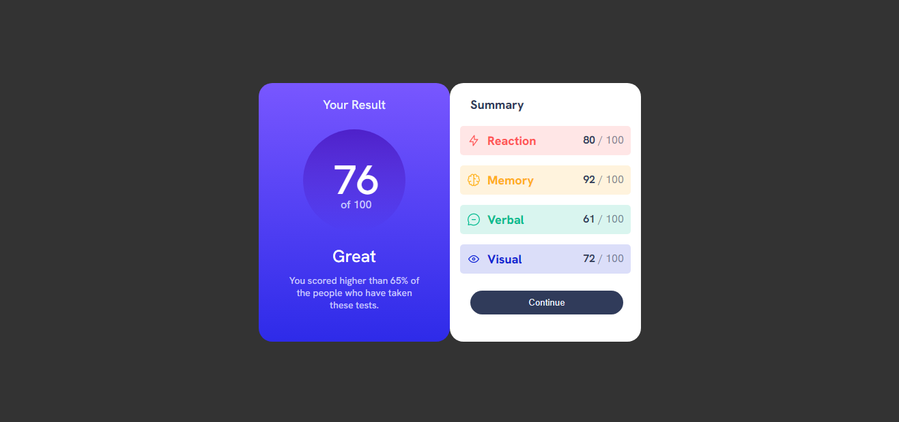
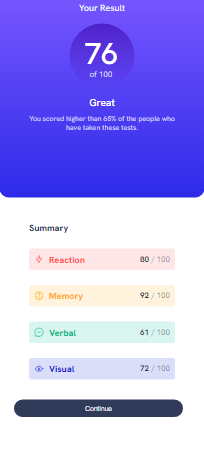

# Frontend Mentor - Results summary component solution

This is a solution to the [Results summary component challenge on Frontend Mentor](https://www.frontendmentor.io/challenges/results-summary-component-CE_K6s0maV). Frontend Mentor challenges help you improve your coding skills by building realistic projects. 

## Table of contents

- [Overview](#overview)
  - [The challenge](#the-challenge)
  - [Screenshot](#screenshot)
  - [Links](#links)
- [My process](#my-process)
  - [Built with](#built-with)
  - [What I learned](#what-i-learned)
- [Author](#author)

## Overview

### The challenge

Users should be able to:

- View the optimal layout for the interface depending on their device's screen size
- See hover and focus states for all interactive elements on the page

### Screenshot

### Links

- Solution URL: [Add solution URL here](https://your-solution-url.com)
- Live Site URL: [Add live site URL here](https://your-live-site-url.com)

## My process

### Built with

- Semantic HTML5 markup
- CSS
- Flexbox
- CSS Grid
- Media querys

### What I learned

I could practice with this the centering of components, I use flexbox and margin 0 auto a couple of times. Also I learned more about hsl colors, I wasn't very familiar with that. But I found it entertaining and had a lot of fun I can't wait to resolve more challenges!

## Author

- Github - [Isaac Lezama](https://github.com/IsaacLezama)
- Frontend Mentor - [@IsaacLezama](https://www.frontendmentor.io/profile/IsaacLezama)